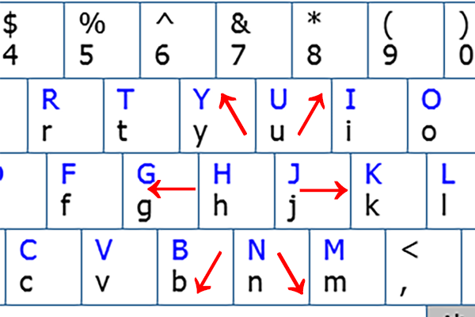
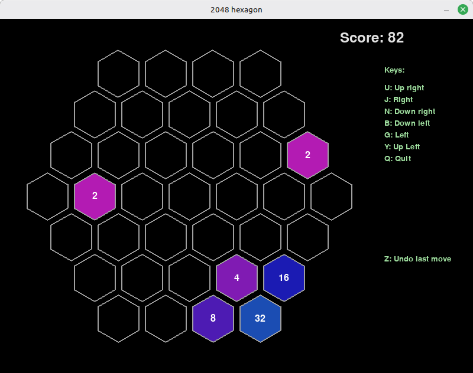
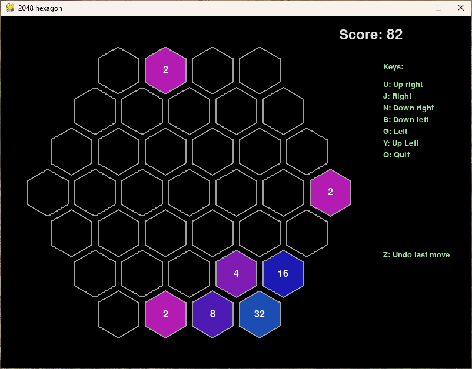

# Hexagon 2048

This is well known game 2048, but with hexagonal grid.

## Run game

First you have to install **pygame**. You can do it with ```pip3 install pygame``` o ```pip3 install -r requirements.txt```.

Next you may run game: ```python3.12 main.py```.

## Game controls

Use these keys:

- U: move up left;
- J: move left;
- N: move down left;
- B: move down right;
- G: move right;
- Y: move up right;
- Z: undo last move (only 1);
- Q: quit.



## Score

You have 1 point for every move and some points for cells merge:

- 2 + 2 (4) - 2 points
- 4 + 4 (8) - 3 points
- 8 + 8 (16) - 4 points
- etc. 

**Attention!** Every move you have points only for unique merges. For example, if you have 2 or 3 merges 2 + 2, in any case you have only 2 points. But if in one movement you have different merges you have points for every merge. For example, in one movement you have merges 2 + 2 and 4 + 4. In this case you will have 6 points - 1 for move and 2 and 3 for merges.

## Screenshots

### Linux Mint 22.3



### Windows 11


